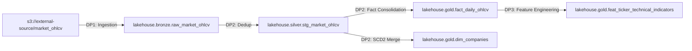

# DataHub Metadata & Lineage Proof
> Emitted at `2026-11-12T07:14:58.679990+00:00` | Pipelines: **DP1, DP2, DP3**

```mermaid
flowchart LR
    S3["s3://external-source/market_ohlcv"] -->|"DP1: Ingestion"| Bronze["lakehouse.bronze.raw_market_ohlcv"]
    Bronze -->|"DP2: Dedup"| Silver["lakehouse.silver.stg_market_ohlcv"]
    Silver -->|"DP2: Fact Consolidation"| Fact["lakehouse.gold.fact_daily_ohlcv"]
    Silver -->|"DP2: SCD2 Merge"| Dim["lakehouse.gold.dim_companies"]
    Fact -->|"DP3: Feature Engineering"| Feat["lakehouse.gold.feat_ticker_technical_indicators"]
```

